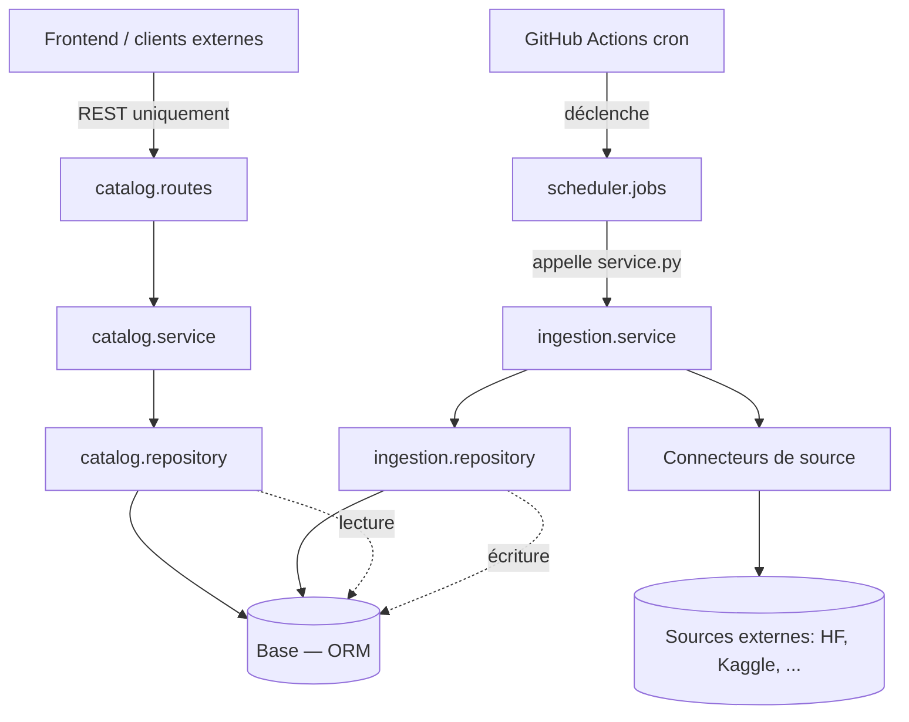
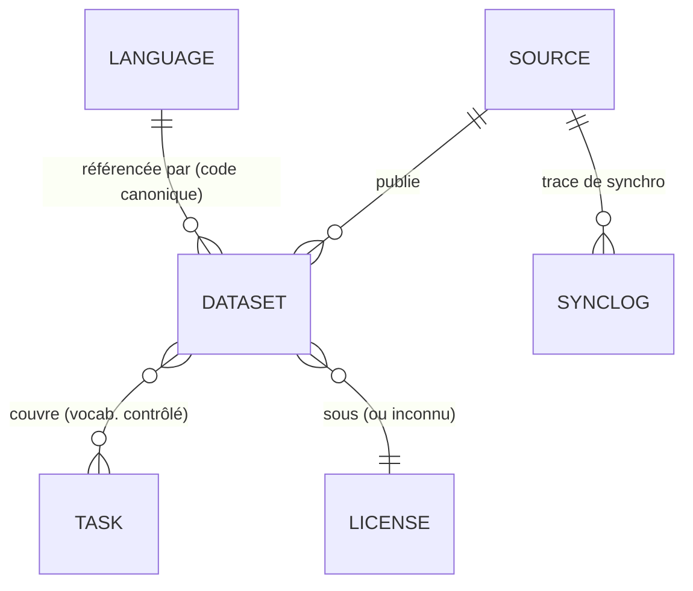
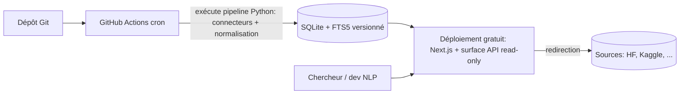

# Architecture Spine — AfroLang-Library

## Design Paradigm

**Monolithe modulaire, en couches.** Un seul déploiement backend, une seule base de code, organisée pour extraire un module en service séparé plus tard si nécessaire.

Deux axes se superposent :
- **Vertical (domaine)** : modules `catalog`, `ingestion`, `scheduler`.
- **Horizontal (couches)** : dans chaque module, `routes` → `service` → `repository` → `models`.

`core/` porte la plomberie transverse (config, accès base, logs) et ne connaît aucun concept métier.

```text
backend-api/
  core/         # config, accès base (ORM), logging + ENTITÉS PARTAGÉES (Dataset, Language, Source, Task, License) — cf. AD-12
  catalog/      # recherche + exposition API REST (routes/service/repository/models)
  ingestion/    # connecteurs + normalisation + écriture (service/repository/models)
  scheduler/    # point d'entrée déclenché par GitHub Actions (jobs)
  main.py
frontend-app/   # Next.js — UI web (+ surface API read-only, cf. Deferred)
.github/workflows/  # cron de synchronisation (GitHub Actions)
```

## Invariants & Rules



### AD-1 — Monolithe modulaire [ADOPTED]
- **Binds:** tout le backend
- **Prevents:** organisation divergente entre modules ; complexité microservices non justifiée à 3 personnes
- **Rule:** le code est organisé en modules de domaine (`catalog`, `ingestion`, `scheduler`), chacun découpé en couches `routes`/`service`/`repository`/`models`. Pas de microservices.

### AD-2 — Frontières inter-modules [ADOPTED]
- **Binds:** tous les modules
- **Prevents:** couplage aux détails internes d'un autre module
- **Rule:** un module n'appelle que le `service.py` d'un autre module, jamais son `repository.py` ni ses `models.py`. `catalog` et `ingestion` ne communiquent qu'**indirectement, via la base**.

### AD-3 — `catalog` = seule surface d'accès aux données [ADOPTED]
- **Binds:** `catalog`, frontend, clients externes
- **Prevents:** couplage de schéma entre la base et des systèmes externes
- **Rule:** le frontend et tout client externe (y compris un futur module de benchmarking) accèdent aux données **uniquement via l'API REST de `catalog`**, jamais directement à la base.

### AD-4 — Accès aux données via `repository` + ORM (garde-fou de réversibilité)
- **Binds:** tous les modules
- **Prevents:** fuite du moteur de stockage (SQLite/PostgreSQL) dans la logique métier ; rend tout changement de stockage localisé
- **Rule:** toute persistance passe par la couche `repository` au moyen d'un ORM (SQLModel/SQLAlchemy). `service.py` et la logique métier sont agnostiques du moteur de stockage.

### AD-5 — Ordonnancement externe (GitHub Actions cron)
- **Binds:** `scheduler`, pipeline d'ingestion
- **Prevents:** dépendance à un hébergement « always-on » (incompatible avec le zéro-budget durable)
- **Rule:** la synchronisation périodique est déclenchée par un cron GitHub Actions qui invoque le point d'entrée d'ingestion. Pas de minuterie interne ni de processus toujours allumé.

### AD-6 — Connecteurs de source enfichables
- **Binds:** `ingestion`
- **Prevents:** codage en dur vers des plateformes précises ; formes de connecteurs divergentes
- **Rule:** chaque Source est intégrée via un Connecteur respectant un contrat commun : il produit ses métadonnées dans une **structure intermédiaire commune définie**, consommée uniformément par la normalisation. Ajouter une Source = ajouter un Connecteur, sans toucher au reste.

### AD-7 — Identité de langue canonique
- **Binds:** `ingestion` (normalisation), `catalog` (recherche)
- **Prevents:** résultats manquants à la recherche à cause des nommages incohérents entre sources
- **Rule:** toute valeur de langue brute est mappée vers un code canonique **ISO 639-3** (Glottolog en repli) ; la valeur brute est conservée pour traçabilité ; la recherche et les filtres opèrent sur le code canonique.

### AD-8 — Vocabulaire contrôlé des tâches NLP
- **Binds:** `ingestion`, `catalog`
- **Prevents:** fragmentation des filtres due aux tags hétérogènes
- **Rule:** les tags de tâche bruts sont mappés vers un vocabulaire contrôlé fixe ; le filtrage opère sur ce vocabulaire.

### AD-9 — Métadonnées uniquement, aucune donnée hébergée
- **Binds:** tout
- **Prevents:** dérive vers l'hébergement (coût, licences) ; datasets rendus invisibles faute de métadonnée
- **Rule:** le système ne stocke que les métadonnées normalisées et le lien de redirection, jamais le contenu d'un dataset. Une métadonnée absente → « inconnu », le dataset reste référencé.

### AD-10 — Pas d'authentification en v1, surface publique en lecture seule
- **Binds:** API `catalog`, frontend
- **Prevents:** coût et complexité d'une gestion d'utilisateurs non requise
- **Rule:** pas de comptes ni d'auth ; la surface publique est en lecture seule. L'ajout manuel d'entrées sans API (FR-5) est une opération interne/hors-ligne (données versionnées), pas une UI authentifiée.

### AD-11 — Mise à jour atomique de l'index
- **Binds:** `ingestion` (écriture), `catalog` (lecture)
- **Prevents:** lecteurs voyant un index partiel/vide pendant une synchronisation
- **Rule:** une synchronisation publie un état d'index complet ; un lecteur voit toujours l'ancien état ou le nouvel état complet, jamais un état partiel.

### AD-12 — Propriété du schéma des entités partagées
- **Binds:** `ingestion`, `catalog`, `core`
- **Prevents:** deux définitions divergentes d'une même table (écrite par `ingestion`, lue par `catalog`) ; deux propriétaires d'une entité
- **Rule:** le schéma canonique des entités partagées (`Dataset`, `Language`, `Source`, `Task`, `License`) est défini **une seule fois dans `core/`**, dont dépendent à la fois `ingestion` (écriture) et `catalog` (lecture). Les `models.py` de module ne contiennent que les tables privées du module (ex. le journal de synchro d'`ingestion`). C'est l'exception explicite à AD-2 pour le contrat de données partagé.

### AD-13 — Observabilité de la synchronisation, pas d'échec silencieux
- **Binds:** `ingestion`, `scheduler`, connecteurs
- **Prevents:** dégradation silencieuse de l'index (connecteur cassé non détecté) — enjeu de la contre-métrique SM-C2 du PRD
- **Rule:** chaque exécution de synchronisation enregistre une trace (date, source, ajouts/retraits, erreurs) ; l'échec d'un connecteur est rendu **visible** (journalisé/remonté), jamais avalé silencieusement ; l'échec d'un connecteur **n'interrompt pas** les autres.

## Consistency Conventions

| Concern | Convention |
| --- | --- |
| Nommage | Modules et fichiers en `snake_case` ; entités du modèle en `PascalCase` (`Dataset`, `Language`, `Source`, `Task`, `License`). |
| Porte d'entrée d'un module | `service.py` est l'unique point d'entrée officiel d'un module (AD-2). |
| Données & formats | API REST, réponses **JSON** ; codes de langue en **ISO 639-3** ; dates en **ISO 8601** ; métadonnée absente = chaîne `"inconnu"`. |
| Traçabilité de normalisation | Toujours conserver la valeur brute d'origine à côté de la valeur normalisée (langue, tâche). |
| État & transverse | Écritures via `ingestion` uniquement ; lectures via `catalog` uniquement ; accès base via `repository`+ORM (AD-4) ; logs et config via `core/`. |
| Origine d'une entrée | Chaque dataset porte son origine : `synchronisée` vs `manuelle` (AD-10). |

## Stack

| Name | Version |
| --- | --- |
| Next.js (frontend) | 16.2.x |
| Python | 3.12 / 3.13 |
| FastAPI (API `catalog`) | 0.136.x |
| ORM (SQLModel / SQLAlchemy) | courant |
| SQLite + FTS5 (stockage) ⏳ provisoire | embarqué |
| GitHub Actions (cron de synchro) | — |
| Hébergement gratuit (Vercel / Netlify) ⏳ provisoire | offre gratuite |

> ⏳ Les lignes marquées « provisoire » sont le choix **Option B** (static-first), pris pour débloquer et **à confirmer avec l'équipe** — voir Deferred. Le garde-fou AD-4 rend un basculement vers PostgreSQL/serveur (Option A) ou hybride (C) peu coûteux.

## Structural Seed

Modèle d'entités (noms et relations ; les attributs qui sont eux-mêmes des invariants sont des AD, pas ce diagramme) :



Topologie de déploiement (Option B provisoire) :



## Capability → Architecture Map

| Capacité (FR du PRD) | Vit dans | Gouverné par |
| --- | --- | --- |
| FR-1 Connecteur de source | `ingestion` (connecteurs) | AD-6 |
| FR-2 Synchronisation planifiée | `.github/workflows` + `scheduler` | AD-5 |
| FR-3 / FR-4 Retrait / ajout de datasets | `ingestion` | AD-11 |
| FR-5 Ajout manuel (sans API) | `ingestion` (hors-ligne) | AD-10 |
| FR-6 Normalisation de la langue | `ingestion` | AD-7 |
| FR-7 Normalisation de la tâche | `ingestion` | AD-8 |
| FR-8 Métadonnées manquantes | `ingestion` | AD-9 |
| FR-9 / FR-10 Persistance / mise à jour atomique | `repository` + base | AD-4, AD-11 |
| FR-11 / FR-12 / FR-13 Recherche / filtres / fiche | `catalog` | AD-3 |
| FR-14 Pages par langue | `catalog` | AD-3 |
| FR-15 API publique | `catalog` (`routes`) | AD-3 |

## Deferred

- **Moteur de stockage & topologie de déploiement (Option A / B / C)** — choix **provisoire B** (SQLite + déploiement gratuit unique), à confirmer avec l'équipe. Garde-fou : AD-4 rend le basculement localisé.
- **Façon de servir l'API en Option B** (route handlers Next.js lisant le SQLite embarqué vs fonctions serverless FastAPI vs JSON pré-généré) — à trancher avec le stockage.
- **Fréquence de synchronisation** et quotas/limites des API des sources — à mesurer (dépend des sources retenues).
- **Liste définitive du vocabulaire contrôlé des tâches NLP** (AD-8) — à figer par l'équipe.
- **Méthode de détection « langue africaine »** à l'ingestion (filtrage du bruit) — à concevoir.
- **Politique de conditions d'utilisation / attribution** des sources — à clarifier.
- **Sources au-delà de HF/Kaggle** disposant d'une API gratuite exploitable — recherche à mener.
- **Cibles de performance, langue de l'interface (FR/EN)** — à définir à l'implémentation.
