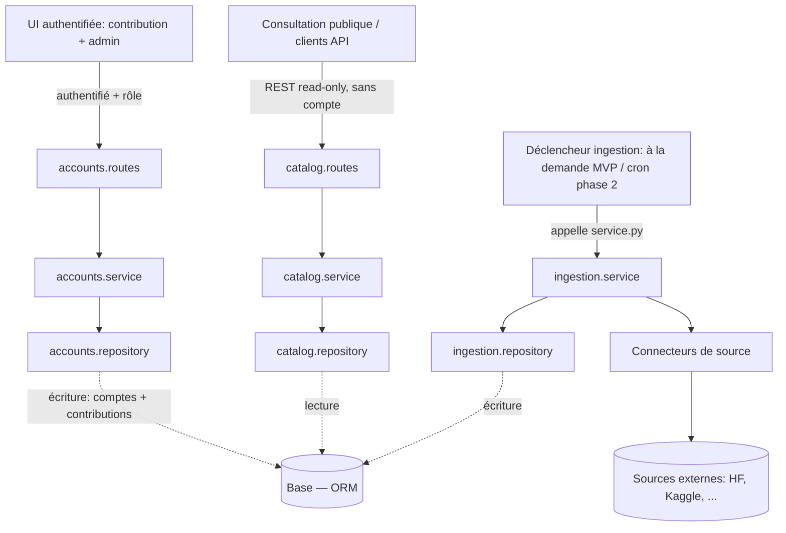
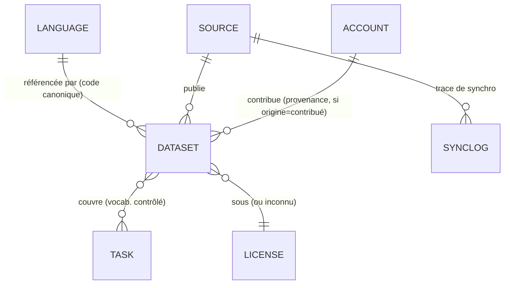
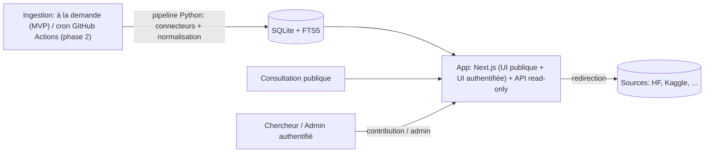

# Architecture Spine — AfroLang-Library

## Design Paradigm

**Monolithe modulaire, en couches.** Un seul déploiement backend, une seule base de code, organisée pour extraire un module en service séparé plus tard si nécessaire.

Deux axes se superposent :
- **Vertical (domaine)** : modules `catalog`, `ingestion`, `scheduler`.
- **Horizontal (couches)** : dans chaque module, `routes` → `service` → `repository` → `models`.

`core/` porte la plomberie transverse (config, accès base, logs) et ne connaît aucun concept métier.

```text
backend-api/
  core/         # config, accès base (ORM), logging + ENTITÉS PARTAGÉES (Dataset, Language, Source, Task, License, Account) — cf. AD-12
  catalog/      # recherche + exposition API REST read-only (routes/service/repository/models)
  ingestion/    # connecteurs + normalisation + écriture (service/repository/models)
  accounts/     # comptes, authentification, rôles, contributions, admin (routes/service/repository/models) — cf. AD-10, AD-14
  scheduler/    # point d'entrée d'ingestion (à la demande au MVP ; cron GitHub Actions en phase 2) — cf. AD-5
  main.py
frontend-app/   # Next.js — UI web publique (consultation) + UI authentifiée (contribution, admin) + surface API read-only
.github/workflows/  # cron de synchronisation (GitHub Actions) — PHASE 2
```

## Invariants & Rules


```mermaid
graph TD
  PUB[Consultation publique / clients API] -->|REST read-only, sans compte| CR[catalog.routes]
  CR --> CS[catalog.service]
  CS --> CRepo[catalog.repository]
  AUTHUI[UI authentifiée: contribution + admin] -->|authentifié + rôle| AR[accounts.routes]
  AR --> AS[accounts.service]
  AS --> ARepo[accounts.repository]
  TRIG[Déclencheur ingestion: à la demande MVP / cron phase 2] -->|appelle service.py| IS[ingestion.service]
  IS --> CONN[Connecteurs de source]
  CONN --> EXT[(Sources externes: HF, Kaggle, ...)]
  IS --> IRepo[ingestion.repository]
  CRepo -. lecture .-> DB[(Base — ORM)]
  IRepo -. écriture .-> DB
  ARepo -. écriture: comptes + contributions .-> DB
```

### AD-1 — Monolithe modulaire [ADOPTED]
- **Binds:** tout le backend
- **Prevents:** organisation divergente entre modules ; complexité microservices non justifiée à 3 personnes
- **Rule:** le code est organisé en modules de domaine (`catalog`, `ingestion`, `scheduler`), chacun découpé en couches `routes`/`service`/`repository`/`models`. Pas de microservices.

### AD-2 — Frontières inter-modules [ADOPTED]
- **Binds:** tous les modules
- **Prevents:** couplage aux détails internes d'un autre module
- **Rule:** un module n'appelle que le `service.py` d'un autre module, jamais son `repository.py` ni ses `models.py`. `catalog` et `ingestion` ne communiquent qu'**indirectement, via la base**.

### AD-3 — Accès aux données via API, jamais la base directement [ADOPTED, amendé 2026-07-04]
- **Binds:** `catalog`, `accounts`, frontend, clients externes
- **Prevents:** couplage de schéma entre la base et des systèmes externes ; contournement des règles métier
- **Rule:** le frontend et tout client externe (y compris un futur module de benchmarking) accèdent aux données **uniquement via une API**, jamais directement à la base. La **lecture publique** passe par l'API REST read-only de `catalog` (sans compte) ; les **écritures** (contribution, administration, comptes) passent par l'API authentifiée de `accounts` (AD-10, AD-14).

### AD-4 — Accès aux données via `repository` + ORM (garde-fou de réversibilité)
- **Binds:** tous les modules
- **Prevents:** fuite du moteur de stockage (SQLite/PostgreSQL) dans la logique métier ; rend tout changement de stockage localisé
- **Rule:** toute persistance passe par la couche `repository` au moyen d'un ORM (SQLModel/SQLAlchemy). `service.py` et la logique métier sont agnostiques du moteur de stockage.

### AD-5 — Ingestion à la demande au MVP ; ordonnancement externe en phase 2 [amendé 2026-07-04]
- **Binds:** `scheduler`, pipeline d'ingestion
- **Prevents:** dépendance à un hébergement « always-on » (incompatible avec le zéro-budget durable)
- **Rule:** au MVP, l'ingestion est **déclenchée à la demande** (invocation manuelle du point d'entrée). L'**automatisation planifiée** (cron GitHub Actions) est en **phase 2**. Dans tous les cas : **pas de minuterie interne ni de processus toujours allumé**.

### AD-6 — Connecteurs de source enfichables
- **Binds:** `ingestion`
- **Prevents:** codage en dur vers des plateformes précises ; formes de connecteurs divergentes
- **Rule:** chaque Source est intégrée via un Connecteur respectant un contrat commun : il produit ses métadonnées dans une **structure intermédiaire commune définie**, consommée uniformément par la normalisation. Ajouter une Source = ajouter un Connecteur, sans toucher au reste.

### AD-7 — Identité de langue canonique
- **Binds:** `ingestion` (normalisation), `catalog` (recherche)
- **Prevents:** résultats manquants à la recherche à cause des nommages incohérents entre sources
- **Rule:** toute valeur de langue brute est mappée vers un code canonique **ISO 639-3** (Glottolog en repli) ; la valeur brute est conservée pour traçabilité ; la recherche et les filtres opèrent sur le code canonique.

### AD-8 — Vocabulaire contrôlé des tâches NLP
- **Binds:** `ingestion`, `catalog`
- **Prevents:** fragmentation des filtres due aux tags hétérogènes
- **Rule:** les tags de tâche bruts sont mappés vers un vocabulaire contrôlé fixe ; le filtrage opère sur ce vocabulaire.

### AD-9 — Métadonnées uniquement, aucune donnée hébergée
- **Binds:** tout
- **Prevents:** dérive vers l'hébergement (coût, licences) ; datasets rendus invisibles faute de métadonnée
- **Rule:** le système ne stocke que les métadonnées normalisées et le lien de redirection, jamais le contenu d'un dataset. Une métadonnée absente → « inconnu », le dataset reste référencé.

### AD-10 — Consultation publique en lecture seule ; écritures derrière authentification [amendé 2026-07-04]
- **Binds:** `catalog`, `accounts`, frontend
- **Prevents:** exposition publique d'opérations d'écriture ; couplage de la consultation à un compte
- **Rule:** la **consultation** (recherche web + API `catalog`) est **publique, en lecture seule, sans compte**. Toute **écriture** — contribution d'un Dataset, administration, gestion des comptes — exige une **authentification** et passe par `accounts`, séparément de l'API publique de lecture. *(Remplace la décision initiale « pas d'auth en v1 », invalidée par la révision comptes/contributions du PRD.)*

### AD-11 — Mise à jour atomique de l'index
- **Binds:** `ingestion` (écriture), `catalog` (lecture)
- **Prevents:** lecteurs voyant un index partiel/vide pendant une synchronisation
- **Rule:** une synchronisation publie un état d'index complet ; un lecteur voit toujours l'ancien état ou le nouvel état complet, jamais un état partiel.

### AD-12 — Propriété du schéma des entités partagées
- **Binds:** `ingestion`, `catalog`, `core`
- **Prevents:** deux définitions divergentes d'une même table (écrite par `ingestion`, lue par `catalog`) ; deux propriétaires d'une entité
- **Rule:** le schéma canonique des entités partagées (`Dataset`, `Language`, `Source`, `Task`, `License`, `Account`) est défini **une seule fois dans `core/`**, dont dépendent `ingestion` (écriture), `accounts` (écriture : comptes + contributions) et `catalog` (lecture). Les `models.py` de module ne contiennent que les tables privées du module (ex. le journal de synchro d'`ingestion`). C'est l'exception explicite à AD-2 pour le contrat de données partagé.

### AD-13 — Observabilité de la synchronisation, pas d'échec silencieux
- **Binds:** `ingestion`, `scheduler`, connecteurs
- **Prevents:** dégradation silencieuse de l'index (connecteur cassé non détecté) — enjeu de la contre-métrique SM-C2 du PRD
- **Rule:** chaque exécution de synchronisation enregistre une trace (date, source, ajouts/retraits, erreurs) ; l'échec d'un connecteur est rendu **visible** (journalisé/remonté), jamais avalé silencieusement ; l'échec d'un connecteur **n'interrompt pas** les autres.

### AD-14 — Contrôle d'accès par rôle et propriété
- **Binds:** `accounts`, toute opération d'écriture sur un Dataset
- **Prevents:** un Chercheur agissant sur les données d'autrui ; escalade de privilèges ; écriture non authentifiée
- **Rule:** deux rôles — **Chercheur** et **Admin**. Toute opération d'écriture vérifie l'authentification **et** l'autorisation : un **Chercheur** ne peut lire-en-gestion / modifier / supprimer que les Datasets dont il est la Provenance (les siens) ; un **Admin** a la maîtrise globale (tous les Datasets, quelle qu'en soit l'origine) et gère les Comptes. La vérification se fait côté serveur (`accounts.service`), jamais uniquement dans l'UI.

### AD-15 — Provenance des datasets
- **Binds:** `ingestion`, `accounts`, `catalog`
- **Prevents:** confusion entre données synchronisées et contribuées ; le retrait automatique effaçant des contributions
- **Rule:** chaque Dataset porte une **origine** : `synchronisé` (via Connecteur), `contribué` (rattaché au Compte du Chercheur), ou `manuel`. Le retrait automatique lors de l'ingestion (AD-11, FR-3) ne s'applique **qu'aux** Datasets `synchronisé` ; les Datasets `contribué` et `manuel` ne sont jamais supprimés par une ingestion.

## Consistency Conventions

| Concern | Convention |
| --- | --- |
| Nommage | Modules et fichiers en `snake_case` ; entités du modèle en `PascalCase` (`Dataset`, `Language`, `Source`, `Task`, `License`). |
| Porte d'entrée d'un module | `service.py` est l'unique point d'entrée officiel d'un module (AD-2). |
| Données & formats | API REST, réponses **JSON** ; codes de langue en **ISO 639-3** ; dates en **ISO 8601** ; métadonnée absente = chaîne `"inconnu"`. |
| Traçabilité de normalisation | Toujours conserver la valeur brute d'origine à côté de la valeur normalisée (langue, tâche). |
| État & transverse | Lectures via `catalog` ; écritures via `ingestion` (synchronisé) ou `accounts` (contribué/admin) ; accès base via `repository`+ORM (AD-4) ; logs et config via `core/`. |
| Origine d'une entrée | Chaque dataset porte son origine : `synchronisé` · `contribué` · `manuel` (AD-15). |
| Autorisation | Toute écriture vérifie authentification + rôle/propriété côté serveur (AD-14) ; l'UI ne fait pas foi. |

## Stack

| Name | Version |
| --- | --- |
| Next.js (frontend) | 16.2.x |
| Python | 3.12 / 3.13 |
| FastAPI (API `catalog`) | 0.136.x |
| ORM (SQLModel / SQLAlchemy) | courant |
| SQLite + FTS5 (stockage) ⏳ provisoire | embarqué |
| Auth gratuite (Auth.js/NextAuth, ou auth Supabase) ⏳ provisoire | courant |
| GitHub Actions (cron de synchro — phase 2) | — |
| Hébergement gratuit (Vercel / Netlify) ⏳ provisoire — déploiement différé | offre gratuite |

> ⏳ Les lignes marquées « provisoire » sont le choix **Option B** (static-first), pris pour débloquer et **à confirmer avec l'équipe** — voir Deferred. Le garde-fou AD-4 rend un basculement vers PostgreSQL/serveur (Option A) ou hybride (C) peu coûteux.

## Structural Seed

Modèle d'entités (noms et relations ; les attributs qui sont eux-mêmes des invariants sont des AD, pas ce diagramme) :


```mermaid
erDiagram
  LANGUAGE ||--o{ DATASET : "référencée par (code canonique)"
  SOURCE   ||--o{ DATASET : "publie"
  DATASET  }o--o{ TASK : "couvre (vocab. contrôlé)"
  DATASET  }o--|| LICENSE : "sous (ou inconnu)"
  SOURCE   ||--o{ SYNCLOG : "trace de synchro"
  ACCOUNT  ||--o{ DATASET : "contribue (provenance, si origine=contribué)"
```

Topologie de déploiement (Option B provisoire ; MVP en local, déploiement différé) :


```mermaid
graph LR
  TRIG["Ingestion: à la demande (MVP) / cron GitHub Actions (phase 2)"] -->|pipeline Python: connecteurs + normalisation| SQLITE[(SQLite + FTS5)]
  SQLITE --> APP["App: Next.js (UI publique + UI authentifiée) + API read-only"]
  PUB[Consultation publique] --> APP
  AUTHU[Chercheur / Admin authentifié] -->|contribution / admin| APP
  APP -->|redirection| EXT[(Sources: HF, Kaggle, ...)]
```

## Capability → Architecture Map

| Capacité (FR du PRD) | Vit dans | Gouverné par |
| --- | --- | --- |
| FR-1 Connecteur de source | `ingestion` (connecteurs) | AD-6 |
| FR-2 Déclenchement de l'ingestion (à la demande MVP ; cron phase 2) | `scheduler` (+ `.github/workflows` en phase 2) | AD-5 |
| FR-3 / FR-4 Retrait / ajout de datasets | `ingestion` | AD-11, AD-15 |
| FR-5 Référencement manuel (sans API) | `accounts` (UI) | AD-14, AD-15 |
| FR-6 Normalisation de la langue | `ingestion` | AD-7 |
| FR-7 Normalisation de la tâche | `ingestion` | AD-8 |
| FR-8 Métadonnées manquantes | `ingestion` | AD-9 |
| FR-9 / FR-10 Persistance / mise à jour atomique | `repository` + base | AD-4, AD-11 |
| FR-11 / FR-12 / FR-13 Recherche / filtres / fiche | `catalog` | AD-3 |
| FR-14 Pages par langue | `catalog` | AD-3 |
| FR-15 API publique (lecture seule) | `catalog` (`routes`) | AD-3, AD-10 |
| FR-16 Comptes & authentification | `accounts` | AD-10, AD-14 |
| FR-17 Contribution d'un dataset (provenance) | `accounts` | AD-14, AD-15 |
| FR-18 Chercheur gère ses propres datasets | `accounts` | AD-14 |
| FR-19 Administration des datasets (CRUD global) | `accounts` (admin) | AD-14 |
| FR-20 Gestion des comptes | `accounts` (admin) | AD-14 |

## Deferred

- **Moteur de stockage & topologie de déploiement (Option A / B / C)** — choix **provisoire B** (SQLite + déploiement gratuit unique), à confirmer avec l'équipe. Garde-fou : AD-4 rend le basculement localisé.
- **Façon de servir l'API en Option B** (route handlers Next.js lisant le SQLite embarqué vs fonctions serverless FastAPI vs JSON pré-généré) — à trancher avec le stockage.
- **Solution d'authentification gratuite** (Auth.js/NextAuth vs auth Supabase vs autre) — à trancher ; dépend en partie du choix de stockage/déploiement.
- **Automatisation planifiée de l'ingestion (cron GitHub Actions)** — PHASE 2 ; au MVP l'ingestion est à la demande (AD-5).
- **Déploiement public + durcissement de la sécurité** (protection de l'admin et de la surface d'écriture, politique de mots de passe) — différé ; le MVP tourne en local.
- **Favoris** (PHASE 2) — un utilisateur ajoute un Dataset à ses favoris ; au clic, s'il n'est pas authentifié, invite à se connecter/créer un compte, sinon ajout. S'appuie sur le modèle `Account` (entité `ACCOUNT` ↔ favoris à ajouter au modèle en phase 2).
- **Fréquence de synchronisation** (phase 2) et quotas/limites des API des sources — à mesurer.
- **Liste définitive du vocabulaire contrôlé des tâches NLP** (AD-8) — à figer par l'équipe.
- **Méthode de détection « langue africaine »** à l'ingestion (filtrage du bruit) — à concevoir.
- **Politique de conditions d'utilisation / attribution** des sources — à clarifier.
- **Sources au-delà de HF/Kaggle** disposant d'une API gratuite exploitable — recherche à mener.
- **Cibles de performance, langue de l'interface (FR/EN)** — à définir à l'implémentation.
