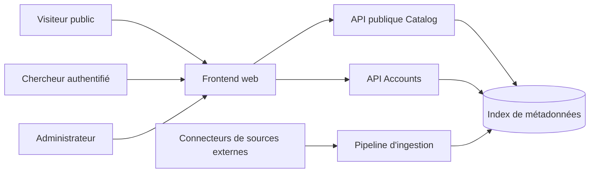
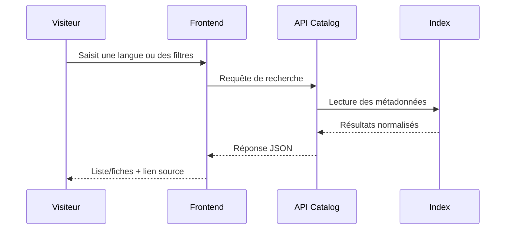
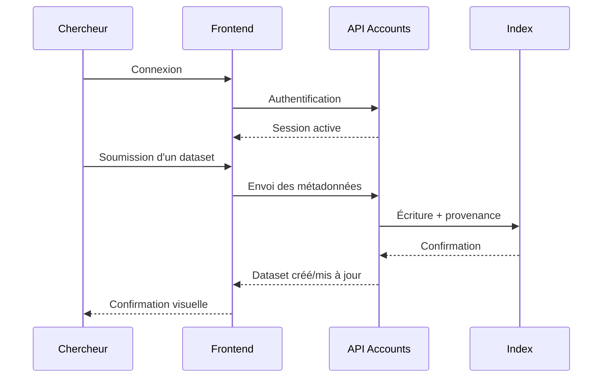
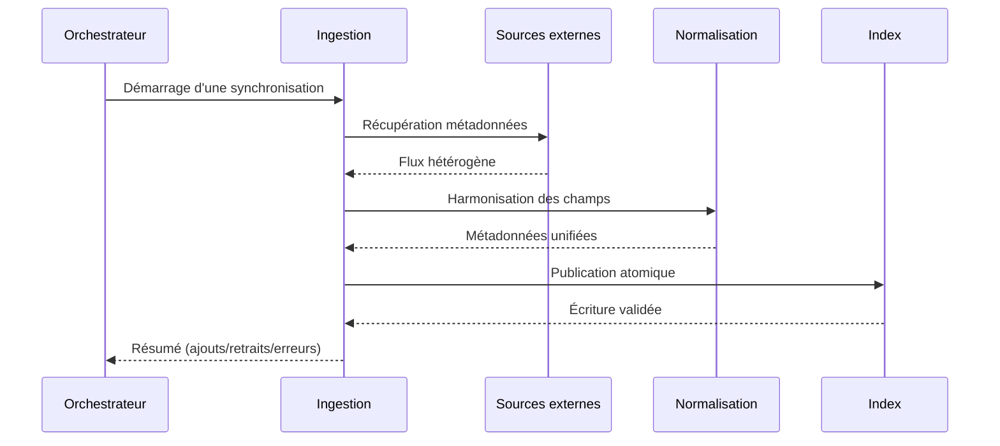

# Fonctionnement global de la plateforme AfroLang-Library

## 1. But de la plateforme

AfroLang-Library sert de **répertoire unifié** de datasets de langues africaines.
La plateforme ne stocke pas les données brutes des datasets, mais leurs **métadonnées** (langue, tâche NLP, source, licence, format, lien, provenance), afin de :

- faciliter la découverte des ressources,
- améliorer la qualité de recherche via la normalisation,
- permettre la contribution communautaire,
- offrir une base fiable pour les usages académiques et industriels.

## 2. Vue d'ensemble

La solution s'organise autour de deux grandes surfaces :

- **Surface publique** : consultation web + API publique en lecture seule.
- **Surface authentifiée** : contribution chercheur et administration.

En arrière-plan, un pipeline d'ingestion récupère les métadonnées depuis des sources externes, les normalise, puis les publie dans l'index interne.

## 3. Composantes et rôle de chacune

### 3.1 Frontend web

Le frontend est l'interface utilisateur principale.

**Rôle :**

- afficher le catalogue,
- permettre les recherches et filtres,
- présenter les fiches datasets,
- gérer les parcours de connexion, contribution et administration,
- exposer une documentation API côté produit.

**Résultat attendu :**

- expérience cohérente pour les visiteurs, chercheurs et admins,
- accès rapide aux informations utiles,
- orientation claire vers les liens sources des datasets.

### 3.2 API publique (Catalog)

L'API Catalog est la porte d'entrée programme pour la consultation.

**Rôle :**

- fournir des endpoints en lecture seule,
- retourner des données normalisées au format JSON,
- garantir la cohérence des réponses avec l'interface web.

**Résultat attendu :**

- exploitation simple depuis scripts, outils data et intégrations externes,
- mêmes résultats pour une requête web et API équivalente.

### 3.3 API Accounts (authentification et écriture)

L'API Accounts gère la partie authentifiée de la plateforme.

**Rôle :**

- créer et authentifier des comptes,
- permettre aux chercheurs de soumettre et gérer leurs contributions,
- appliquer les droits d'accès selon le rôle,
- permettre l'administration globale des comptes et des datasets.

**Résultat attendu :**

- séparation claire entre lecture publique et écriture contrôlée,
- traçabilité des contributions,
- gouvernance fiable de l'index.

### 3.4 Pipeline d'ingestion

Le pipeline d'ingestion alimente l'index depuis les plateformes externes.

**Rôle :**

- interroger les sources via connecteurs,
- transformer les métadonnées hétérogènes en schéma commun,
- ajouter les nouveautés,
- retirer les entrées synchronisées devenues obsolètes,
- produire des journaux de synchronisation.

**Résultat attendu :**

- index à jour,
- meilleure couverture des datasets,
- visibilité des erreurs d'ingestion sans blocage global.

### 3.5 Normalisation

La normalisation est le coeur de qualité de la plateforme.

**Rôle :**

- harmoniser les identités de langue,
- harmoniser les tâches NLP,
- conserver la valeur brute d'origine pour la traçabilité,
- gérer les métadonnées manquantes sans exclure les datasets.

**Résultat attendu :**

- recherches plus robustes,
- réduction des faux négatifs,
- comparabilité des ressources entre sources.

### 3.6 Stockage de l'index

Le stockage central conserve l'état publié du catalogue.

**Rôle :**

- persister les métadonnées normalisées,
- servir de base unique pour web, API publique et API authentifiée,
- garantir des mises à jour cohérentes.

**Résultat attendu :**

- stabilité des résultats,
- continuité de service entre deux ingestions,
- source de vérité unifiée.

### 3.7 Orchestration de synchronisation

L'orchestration déclenche l'ingestion (à la demande au MVP, automatisation possible ensuite).

**Rôle :**

- exécuter les connecteurs,
- superviser l'ordre et le suivi des exécutions,
- consolider les traces de traitement.

**Résultat attendu :**

- processus reproductible,
- contrôle opérationnel clair,
- montée en charge progressive vers l'automatisation.

## 4. Interactions principales entre composantes

### 4.1 Parcours de consultation publique

**Résultat attendu :** le visiteur trouve rapidement les datasets pertinents et peut accéder à la source d'origine.

### 4.2 Parcours contribution chercheur

**Résultat attendu :** le chercheur peut gérer ses propres contributions en sécurité, avec traçabilité.

### 4.3 Parcours administration

**Interactions clés :**

- l'admin consulte tous les datasets,
- corrige/supprime les entrées problématiques,
- gère les comptes et rôles.

**Résultat attendu :** qualité éditoriale et sécurité globale de la plateforme.

### 4.4 Parcours ingestion

**Résultat attendu :** l'index reste cohérent et exploitable pendant et après la synchronisation.

## 5. Résultats attendus au niveau plateforme

### 5.1 Pour les utilisateurs publics

- trouver les datasets de langues africaines plus vite,
- comparer les ressources sur un schéma homogène,
- accéder directement aux pages sources.

### 5.2 Pour les chercheurs contributeurs

- rendre leurs datasets visibles,
- maintenir leurs contributions dans le temps,
- bénéficier d'un cadre clair de propriété et de droits.

### 5.3 Pour l'équipe d'administration

- maintenir la qualité du catalogue,
- gérer les comptes et permissions,
- suivre le comportement des synchronisations.

### 5.4 Pour l'écosystème technique

- intégrer facilement l'index via API,
- réutiliser les données normalisées dans d'autres workflows,
- préparer des usages avancés (benchmarking, analytics, monitoring).

## 6. Principes directeurs (niveau fonctionnel)

- **Lisibilité** : l'information doit rester accessible aux profils non techniques.
- **Cohérence** : web et API reposent sur la même source de vérité.
- **Traçabilité** : toute contribution ou synchronisation est attribuable.
- **Séparation des responsabilités** : lecture publique d'un côté, écriture contrôlée de l'autre.
- **Évolutivité** : ajout de sources et enrichissement progressif sans rupture d'usage.

## 7. Résumé

AfroLang-Library agit comme un **hub de métadonnées** entre trois mondes :

- les utilisateurs (public, chercheurs, admins),
- les sources externes de datasets,
- les systèmes consommateurs via API.

La valeur centrale ne vient pas seulement du volume de datasets, mais de la **qualité de normalisation**, de la **gouvernance des écritures** et de la **cohérence d'accès** sur l'ensemble de l'application.
